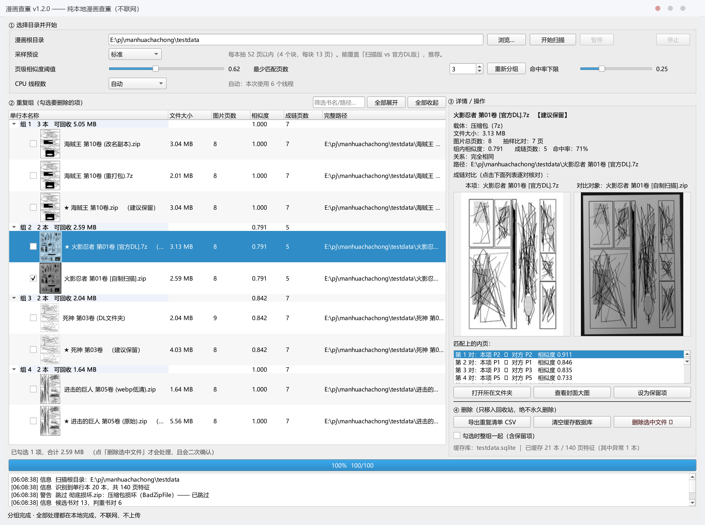
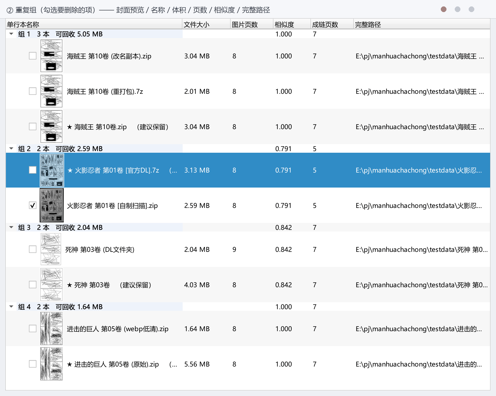
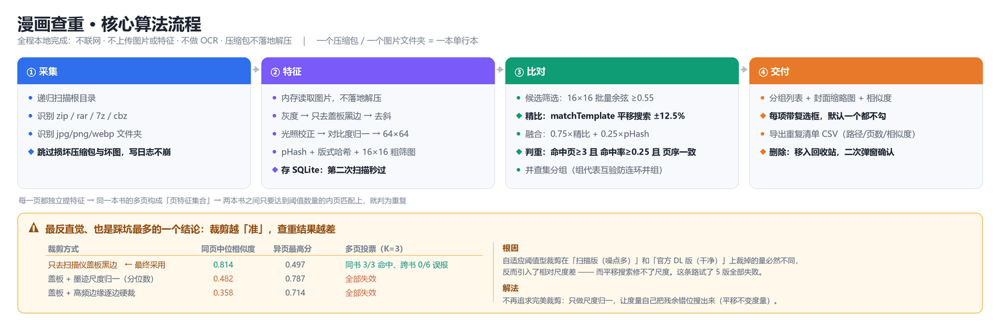

# 漫画查重（ComicDedup）

Windows 本地漫画查重桌面程序。**纯本地离线运行**，专门解决「几千本单行本里哪些是同一本书的重复版本」，
尤其能识别最难的一类：**同一本漫画，一份是自制书本扫描版、另一份是官方 DL 电子版**。

```
一个压缩包（zip / rar / 7z / cbz / cbr / cb7）  =  一本单行本
一个装着 jpg/png/webp 的图片文件夹               =  一本单行本
```



> 上图是程序的**真实界面**（`QT_QPA_PLATFORM=offscreen` 离屏渲染，不会弹出任何窗口），
> 数据来自 `python tools/make_testdata.py` 生成的测试语料（所以每本只有 8~9 页）。
> 选中「火影忍者 第01卷 [官方DL].7z」，程序把它和自制扫描版归为同一组、给出 0.791 相似度与 5 个匹配内页，
> 并建议保留官方 DL 版、勾选删除扫描版。

---

## 致谢

本项目 v1.1 的比对算法重构不是拍脑袋改的：遇到的每一类问题，在文献和开源实现里都有名字、有人踩过。
在此对本项目开发过程中读到的论文与项目一并致谢。具体更新日志 → [CHANGELOG.md](CHANGELOG.md)

**学术论文**

- **On the burstiness of visual elements** —— Hervé Jégou, Matthijs Douze, Cordelia Schmid，CVPR 2009。
  <http://vigir.missouri.edu/~gdesouza/Research/Conference_CDs/IEEE_CVPR_2009/data/papers/1530.pdf>
  本轮最核心的一篇。它定义了「同一个视觉元素反复出现导致的相似度放大」，并给出三种对策，
  其中的 MMR（一对一匹配）正是我们「一对一匹配页数」判据的理论出处；
  我们实测的「共享版权页导致候选爆炸」就是 burstiness 的教科书案例。
- **To Aggregate or Not to Aggregate: Selective Match Kernels for Image Search** ——
  Giorgos Tolias, Yannis Avrithis, Hervé Jégou，ICCV 2013 / IJCV 2015。
  <http://image.ntua.gr/iva/files/Tolias_ijcv15_iasmk.pdf>
  两级阈值结构（`τ_l` 描述子级 + `τ_g` 图像级）来自这里，直接启发了本轮的
  「命中数 + 成链数」双门槛与链长地板（`--chain-floor`）。
- **Sketch-based Manga Retrieval using Manga109 Dataset** —— Yusuke Matsui 等，
  Multimedia Tools and Applications 76(20), 2017。<https://arxiv.org/abs/1510.04389>
  明确指出漫画是黑白线稿、缺少渐变，SIFT 一类为自然图像设计的描述子会失效，
  正确做法是「去网点 + 边缘方向直方图（EOH）」。这是后续对付
  「自制扫描版 vs 官方 DL 版」的思路来源（本轮未落地）。
- **Separation of Manga Line Drawings and Screentones** ——
  Ito, Matsui, Yamasaki, Aizawa，Eurographics 2015 Short Papers。
  <https://www.researchgate.net/publication/277653033>
  上一条的去网点具体算法：LoG + flow-based DoG 双 mask 按连通分量合并，无需人工调参。
- **Efficient Cropping-Resistant Robust Image Hashing** ——
  Martin Steinebach, Huajian Liu, York Yannikos，ARES 2014。<https://doi.org/10.1109/ARES.2014.85>
  提供了「不要猜黑边在哪，而是分段各算一个哈希」的思路，对照出我们现行裁边策略的局限。
- **Results and findings of the 2021 Image Similarity Challenge** —— Papakipos 等，NeurIPS 2021。
  <https://lacuna.tiptreesystems.com/paper/results-and-findings-of-the-2021-image-similarity-challenge/art_59c6a437064c4d06ab84282c17f95f16>
  给出了「别上全局嵌入模型」的关键判据：Descriptor Track 稳定落后 Matching Track 约 0.2 μAP，
  说明区域 / 成对匹配才是我们该走的路。
- **Detection of exact and similar partial copies for copyright protection of manga** ——
  Sun, Kise，IJDAR 16(4), 2013。<https://doi.org/10.1007/s10032-013-0199-y>
  少见的直接面向漫画版权检测的工作，确认了扫描版（印刷拷贝）可被检出。

**开源项目**

- **ComicDup**：本轮「结果分类」这个产品设计的思路来源——读它的代码后，我们把判重结果从「是否重复」升级成了带关系标签的输出。
- [idealo/imagededup](https://github.com/idealo/imagededup)：提供了「给 ground truth 就能量化各算法优劣」的评测框架思路。
- [knjcode/imgdupes](https://github.com/knjcode/imgdupes)：页级 ANN 索引（先找页近邻再聚合到书）的思路来源。
- [simonmcnair/image-deduplicator](https://github.com/simonmcnair/image-deduplicator)：长宽比分桶预筛 + 并查集分组。
- [0x90d/VideoDuplicateFinder](https://deepwiki.com/0x90d/videoduplicatefinder/4.1-main-window)：上三角循环、超阈值立即早退、SIMD 加速等工程技巧。
- [imagehash](https://pypi.org/project/ImageHash/)：`crop_resistant_hash()` 是上文抗裁剪哈希论文的现成实现。

---

## 一、隐私与安全承诺

| 承诺 | 落实方式 |
| --- | --- |
| **不联网** | 源码零网络调用（`--selftest` 有静态检查逐文件核验）；不引入任何 HTTP 客户端库 |
| **不上传任何数据** | 图片、特征、路径全部只在本地内存与 SQLite 里 |
| **压缩包不落地解压** | 图片在内存中读取解码，用完即弃；不往临时目录写文件 |
| **不做 OCR** | 只用分镜图像特征（灰度墨迹分布 + 感知哈希），完全不涉及文字识别 |
| **绝不自动删除** | 每条结果都带复选框、默认不勾；删除必须人工勾选 + **二次弹窗确认** |
| **绝不永久删除** | 优先移入系统回收站；回收站不可用时**移动到**同目录 `_漫画查重回收站\`；代码里没有任何 `rmtree` / `os.remove` / `unlink` |
| **可追溯** | 每次删除都写 `删除记录.csv`（时间 / 对象 / 结果 / 说明） |

---

## 二、快速开始

### 方式 A：直接用打包版（推荐给不想装 Python 的人）

到 [Releases](https://github.com/tmadmao/comicdedup/releases) 下载
`ComicDedupTool-v1.1.0-win64.zip`（约 105 MB，解开后约 259 MB）：

```
解压 → 双击文件夹里的 ComicDedupTool.exe → 选漫画根目录 → 开始扫描
```

不用装 Python、不用装任何依赖，启动是瞬时的。

> 想要**单文件 exe**（只有一个文件、更好管理）可以自己打：
> `python -m PyInstaller --onefile --noconsole --noconfirm --name ComicDedupTool-onefile
> --collect-submodules comicdedup --hidden-import PySide6 comic_dedup.py`
> 代价是每次启动都要把约 260MB 解压到临时目录（等 5~10 秒），且更容易被杀软误报。
>
> 不用下载也行：双击 `打包exe.bat` 能在本地自己打一个出来。

> **7z / rar 的解压需要装 [7-Zip](https://www.7-zip.org/) 或 WinRAR**（zip 不需要）。
> 也可以把 `7z.exe` 直接放到 exe 同目录，程序会自动识别。

> **杀软提示**：本软件为自制工具，未做代码签名；所有代码都在本仓库里，可自行查阅核对。
> 若被杀软误报，把它所在的文件夹加进信任区即可。

### 方式 B：源码运行

```bat
安装依赖.bat          :: 装一次就行
运行工具.bat          :: 打开图形界面
```

或者手动：

```bat
pip install -r requirements.txt
python comic_dedup.py
```

### 方式 C：命令行（适合一次性批处理，3000 本跑一遍很省心）

```bat
python comic_dedup.py --scan "D:\漫画" --csv 重复清单.csv
python comic_dedup.py --scan "D:\漫画" --preset 快速          :: 先快速摸底
python comic_dedup.py --scan "D:\漫画" --jobs 8               :: 指定线程数（默认自动）
python comic_dedup.py --scan "D:\漫画" --log 运行日志.txt      :: 逐条记录跳过/异常原因
python comic_dedup.py --selftest                             :: 自检
python comic_dedup.py --backends                             :: 看解压后端可用情况
python comic_dedup.py --help
```

装了打包版的话，把 `python comic_dedup.py` 换成 `ComicDedupTool.exe` 即可，参数完全一样：

```bat
cd /d D:\漫画查重\ComicDedupTool
ComicDedupTool.exe --scan "D:\漫画" --csv 重复清单.csv
```

> 注意要在 **cmd 窗口里**执行（而不是双击）才能看到输出。
> 打包版是「无控制台」程序：**双击**运行时系统不给它控制台，`--selftest` 这类
> 带输出的子命令会"跑了但看不见"（实测从已有 cmd 窗口启动则输出正常可见）。

输出重定向到文件时是 **UTF-8**（直接看控制台时跟随系统码页，中文 Windows 下是 GBK）——
所以 `--scan ... > 清单.txt` 出来的文件用 VS Code 打开不会乱码。

**界面库三选一即可**：`PyQt5`（首选）/ `PyQt6` / `PySide6`，装哪个都能跑。

---

## 三、界面说明



> 上图是②区的特写：封面缩略图、单行本名称、文件大小、图片页数、相似度、匹配页数、完整路径，
> 以及 ★ 建议保留 标记与人工勾选状态（☑ 的行就是准备删掉的）。

界面结构（对应截图里的四个编号区）：

| 区域 | 内容 |
| --- | --- |
| **① 选择目录并开始** | 根目录输入框 / 浏览 / **开始扫描** / **暂停**（可续跑）/ 停止；采样预设；页级相似度阈值滑块；最少匹配页数；命中率下限；**CPU 线程数**；**重新分组**（改阈值不用重新扫描） |
| **② 重复组** | 按组展示，每组标题给出「几本 / 可回收多少」；每项带**封面缩略图、单行本名称、文件大小、图片总页数、相似度、匹配页数、完整路径**；★ 标记建议保留项；每项带复选框（默认不勾）；上方有筛选框与全部展开/收起 |
| **③ 详情 / 操作** | 选中项的完整路径、载体类型、图片页数/抽样页数、组内相似度、成链页数、命中率；**成链对比**（左右并排显示两本书的对应页，一眼看出是不是同一页）；下方列出**所有匹配上的内页**（点击逐对核对）；打开所在文件夹 / 查看封面大图 / 设为保留项 |
| **④ 删除** | 导出重复清单 CSV / 清空缓存数据库 / **删除选中文件**（二次弹窗确认，只移入回收站） |

底部是进度条 + 运行日志（坏档、跳过、异常都记在这里，程序不会崩）。

* 每一行都有**复选框**（默认不勾），勾选后底部实时显示「已勾选 N 项，合计 X GB」。
* 每组的★标记是**建议保留**项（选中别的一本点「设为保留项」即可改）。

### 3.1 关于 CPU 线程数

界面里多了一个 **CPU 线程数** 下拉，命令行对应 `--jobs`。它同时作用于**扫描**和**精比**两个阶段。

**默认「自动」= `min(8, CPU 逻辑核数)`，一般就是最合适的。** 这个阶段是「解码 + 十几个小算子」
的混合负载。一组参考实测（`tools/probe_threadspeed.py`，测试机为 6 逻辑核 + 本地磁盘）：

| 配置 | ms/页 | 页/秒 | 相对提速 |
| --- | --- | --- | --- |
| 单线程 | 32 ~ 34 | 30 ~ 32 | 1.00x |
| 4 线程 | 9.7 | 103 | 3.2x |
| **6 线程（即「自动」在 6 核上的取值）** | **8.2 ~ 14.1** | **71 ~ 121** | **2.3x ~ 4.1x** |

区间为什么这么宽：测量时机器上还有别的负载在抢 CPU，而多线程对「同时拿到足够多的核」更敏感；
**没有其它负载时会稳定接近 4 倍**（单独测试得到 8.2 ms/页、4.07x）。
不同 CPU、不同磁盘（本地盘 / NAS）的绝对数值会有差异，但**趋势一致：多线程相比单线程有数倍提升**，
所以「自动」在什么机器上都不会是坏选择。

三点值得说明：

* **OpenCV 自带的线程此前几乎没帮上忙**（实测单独开启只有 0.9~1.2x，因为这里的算子都作用在
  1024px 的小图上，并行调度开销把收益吃掉了）。所以现在会**主动把 OpenCV 内部线程数设为 1**，
  改由程序在「页」这一层并行 —— 这才是真正吃满多核的做法。
* **线程数略高于核数是合理的**。另一次测量里，12 线程（超过该测试机的 6 个逻辑核）反而比 6 线程
  快 1.2 倍，说明这一阶段有相当一部分时间花在**等 I/O 与解码**上，多几个线程能把等待重叠掉。
  漫画放在 **NAS** 上时这个效应更明显，可以放心开到核数的 1.5~2 倍；本地磁盘则不要太多。
* **改线程数不需要重新扫描**：缓存按文件校验，已有的特征照常命中，所以你可以先跑一遍，
  不满意再调大线程数重跑，只有新增/变动过的书会重算。

---

## 四、算法原理（这部分是本项目的核心，也是踩坑最多的地方）



**一句话概括**：把每页压成两个小灰度图 + 两个哈希，**用「平移搜索」而不是「精确裁剪」**来比对，
再靠「整本多页投票 + 命中率下限 + 页序一致性」三道闸门判重。

### 4.1 为什么要处理「扫描版 vs 官方 DL 版」

同一页漫画的两类版本差异极大：

| | 自制书本扫描版 | 官方 DL 电子版 |
| --- | --- | --- |
| 纸张底色 | 偏黄偏灰，且**不均匀** | 纯白 |
| 光照 | 装订阴影 + 对角渐变 | 无 |
| 边缘 | 扫描仪盖板黑边、书页歪斜 | 干净、无边框 |
| 质感 | 噪点、散焦、网纹（halftone） | 锐利、色阶干净 |
| 裁切 | 物理页边留白 | 往往裁得更紧，甚至多留/少留一圈 |

所以必须把「与扫描设备相关」的信息全部剥掉，只留下「这一页画了什么」。

### 4.2 单页预处理流水线

```
内存解码(JPEG 走 draft 降采样加速)
  → 自动裁剪（去扫描仪盖板黑边）
  → 去斜（投影剖面峰值最大化；收益 <12% 就不动图）
  → 缩放到统一长边 384
  → 背景光照校正（大尺度背景除法，消纸张底色与阴影渐变）
  → 对比度归一化（2%~98% 分位线性拉伸）
  → 64×64 灰度页图块 + 16×16 粗筛图 + 感知哈希(pHash) + 版式剖面哈希
```

### 4.3 最关键的一步：**平移不变度量**（而不是追求完美裁剪）

这是本项目反复实验后最重要的结论，也是**反直觉**的：

> **裁剪越"准"，查重结果越差。**

| 裁剪方案 | 同页中位相似度 | 同页最低分 | 异页最高分 | 多页投票（K=3） |
| --- | --- | --- | --- | --- |
| **只去扫描仪盖板黑边**（本项目采用） | **0.814** | 0.586 | 0.497 | **同书 3/3 命中，跨书 0/6 误报** |
| 盖板 + 墨迹质量分位尺度归一 | 0.482 | 0.281 | 0.787 | 全部失效 |
| 盖板 + 高频边缘能量逐边硬裁 | 0.358 | 0.191 | 0.714 | 全部失效 |
| 盖板 + 亮区纸面连通块 | 0.352 | 0.191 | 0.714 | 全部失效 |

**原因**：任何「自适应阈值型」的精细裁剪，在**扫描版（噪声大）**和**DL 版（干净）**上
裁掉的量必然不一致，于是引入一个**相对尺度差**；而平移搜索修不了尺度差，
于是「裁得越精细，两版反而越对不上」。

**最终方案**：裁剪只做最低限度的「去掉扫描仪盖板黑边」，剩下的对齐误差交给度量自己搜出来：

```python
# 把 B 的页图块中心 48×48 当模板，在 A 的 64×64 上滑窗做归一化相关，取峰值
cv2.matchTemplate(A_tile, B_tile_center_48, cv2.TM_CCOEFF_NORMED).max()
```

搜索范围 ±8 格 ≈ ±12.5% 幅面，足够吸收两版的裁切差异。
效果：同页最低分从 **0.24 → 0.65**，异页 p99 只有 **0.40**，从「完全不可分」变成「可以判」。

> 参考同类工具的同样结论：AntiDupl 也是先把图归一化到小尺寸再比对，并明确提醒
> 「均方差在大片纯色背景上会误判」；Czkawka 的相似度分档里 16~30 位汉明距离对应的
> 正是「内容相似但可能有裁剪」；DFRWS 2023 的哈希评测论文还实测到
> 「加上边框后 pHash/blockhash 对无关图的平均距离明显下降」——
> 也就是说**带同款边框的图更容易互相误判，去边框是刚需**。

### 4.4 两级级联 + 整本多页投票

单个内页相似度并不可靠（漫画同作者的分镜习惯会让不同页也长得像），
所以判重单位是**整本书**，用的是「达到阈值数量的匹配内页」：

```
第 1 级  候选筛选：把所有抽样页的 16×16 粗筛图做批量矩阵乘法，
                   统计「每两本书之间有多少个相似页对」→ 得到候选书对
                   （避免 B² = 450 万书对的全量精比）
第 2 级  精比：候选书对逐页做平移不变精比，融合 pHash 得分，
               得到页对分数矩阵 → 贪心一对一匹配 → 命中页数
判重条件  成链页数 ≥ K（默认 3）  且（ 命中率 ≥ 下限（默认 0.25） 或  成链页数 ≥ 8 ）
```

**命中率下限是防止「同系列连环并组」的关键**：同一系列不同卷常常共享封面页、
作者页、下集预告页（可能正好 2~3 页）。只看「命中≥3 页」的话，整个系列会被连成一串。
加上「成链页数 ÷ 抽样页数 ≥ 25%」之后，共享 3/40 页的假重复会被直接排除（实测有效）。
「成链 ≥8 页」的豁免则反过来：链长本身就是强证据，不让它被抽样页数多导致的隐式比例下限切掉。

### 4.5 页序一致性校验（最长递增链 LIS）

同一本书的两个版本，**页序必然一致**（漫画不会乱页）。于是：

* 把匹配页对按 A 的页序排好后，B 的页序应当基本单调递增；
* 于是「同书两版」的匹配页对会连成一条**斜线**，而「版式雷同凑出来的假匹配」页码乱跳。

具体判据是**最长递增链（LIS）**：对匹配对的 B 页序求最长递增子序列的长度，
要求 `链长 ≥ K`、（`链长 / 较短那本抽样页数 ≥ 命中率下限` **或** `链长 ≥ 8`）、
且 `链长 / 命中页数 ≥ 0.6`。

> 为什么不沿用早期的「偏移量 90 分位」判据：匹配对数往往只有十几个，
> 90 分位落在倒数第二个点上，**两个离群点就能把整对否掉**（实测一个 11 页完全相同的
> 版本对就这样被漏判）。LIS 只统计「成链」的部分，天然容忍少数离群页。
>
> 思路来自扫描漫画指纹论文里用 **cut（分镜框）位置序列**做指纹的做法，也即
> 近重复检索领域 burstiness（Jégou, CVPR 2009）对策的推广：用页与页的**顺序关系**
> 判重，而不是只看单页像不像。

### 4.6 采样策略（连续块，而不是稀疏锚点）

需求是「随机抽几页非空白内页」。但抽样方式直接决定了**能容忍多大的版本间页数差**：

> 两个版本页数差 ΔP 时，全书 85% 处的对应页**页号**偏移 ≈ 0.85·ΔP。
> 用「稀疏锚点」（每处只抽 1~2 页）去兜这个偏移，偏移一超就整块落空 ——
> 实测页数差 12% 时，稀疏采样只能配上 4 页，直接漏判。

所以 v1.1 起改成**「连续块」采样**：在整本书上均匀放 4 个块、每块连续抽 13 页，
块越长能容忍的偏移越大（块长 13 ≈ 容忍 13 页偏移）。块中心落在开区间 (0,1)、
避开书头尾（另一版多出来的页通常堆在两端）。实测同页数差下，块采样能把
「成链页数」从 4 页提到 7~31 页（提升 1.8~3.8 倍）。

| 预设 | 每本抽样 | 适用 |
| --- | --- | --- |
| 快速 | ≤21 页 | 先摸底，专找「同源改名 / 换格式 / 重压缩」 |
| **标准** | **≤52 页** | **推荐。能覆盖「扫描版 vs 官方 DL 版」及页数差较大的情况** |
| 彻底 | ≤102 页 | 两版页数差得很多时更稳，耗时约 2.5 倍 |
| 全页 | 每一页 | 最准最慢（3000 本 × 180 页 ≈ 54 万页，首次可能要几小时） |

### 4.7 页级阈值标定数据（合成语料，24 页实测）

| 指标 | 同页（扫描版 vs DL 版） | 异页（不同页） |
| --- | --- | --- |
| 最低分 | 0.559 | — |
| 5% 分位 | 0.586 | — |
| 中位 | 0.814 | 0.111 |
| 99% 分位 | — | 0.320 |
| 最高分 | — | 0.497 |

**默认页级阈值 0.62**，取在「异页最高 0.497」与「同页 5% 分位 0.586」之间并留出余量。

| 阈值 | 含义 |
| --- | --- |
| < 0.55 | 偏宽松：同源变体几乎必中，但可能把版式相近的不同页也算上 |
| **0.55 ~ 0.68** | **推荐区间** |
| 0.68 ~ 0.80 | 偏严格：扫描版可能漏掉一部分 |
| > 0.80 | 很严格：基本只认同源文件 |

---

## 五、支持的格式与解压后端

| 格式 | 载体 | 读取方式 |
| --- | --- | --- |
| zip / cbz | `.zip` `.cbz` | **Python 内置 zipfile**（永远可用；自动处理中文文件名编码混乱） |
| rar / cbr | `.rar` `.cbr` | 7-Zip → UnRAR.exe → bsdtar → `rarfile` 库 |
| 7z / cb7 | `.7z` `.cb7` | 7-Zip → bsdtar（Windows 10+ 自带 `C:\Windows\System32\tar.exe`）→ `py7zr` 库 |
| 图片文件夹 | 目录 | 直接读 |

* 按**文件头魔数**判断真实格式（有些 `.zip` 其实是 rar，反之亦然）。
* 页序用**自然排序**（`1.jpg < 2.jpg < 10.jpg`），不会按字典序排错页。
* **一次进程调用读完一本**：要抽的页一次性抽到内存再按成员大小切开，
  而不是每张图调一次解压程序（3000 本 × 10 页 = 3 万次进程调用会慢到没法用）。
* 损坏压缩包 / 损坏图片 → **只记日志并跳过**，程序继续跑，绝不崩。

---

## 六、缓存（第二次扫描秒过）

特征存在本地 SQLite：默认 `%LOCALAPPDATA%\ComicDedup\comics.sqlite`，
封面缩略图**也一起存在这张库里**（不额外生成图片文件）。

* 命中判定 `(路径, 大小, mtime, 特征算法版本)` 四元组；
* 路径会统一收敛成**盘符形式**：网络盘符不会被展开成 UNC，
  所以界面里填 `M:\` 和命令行扫出来的记录是同一份缓存（不会同一本书存两条）；
* 换个采样预设或改算法会让缓存自动失效（不会用错特征）；
* 实测：21 本语料第二次扫描 **21/21 命中，6.8 秒 → 0.2 秒**，且导出的 CSV **逐字节一致**；
* 体积参考：**约 4 KB/页**。3000 本用「标准」预设（52 页/本 ≈ 16 万页）≈ **640 MB**；
  用「快速」预设 ≈ 130 MB。
* 界面上有「清空缓存数据库」（清之前会告诉你当前缓存了多少、重算要多久）。

---

## 七、导出的 CSV 字段

`组号, 建议保留, 单行本名称, 载体, 格式, 文件大小(字节), 文件大小, 图片总页数,
抽样页数, 组内相似度, 成链页数, 命中率, 关系, 完整路径`

其中「成链页数」= 页序对得上的匹配页数，「关系」是判重类型标签
（完全相同 / 页码对齐·两版页数不同 / 有页码偏移 / 有页码偏移·两版页数不同）。

UTF-8 带 BOM（Excel 直接双击不乱码）。

---

## 八、质量验证（均为可复现的自动化测试）

| 测试 | 命令 | 结果 |
| --- | --- | --- |
| 自检 | `python comic_dedup.py --selftest` | **23 项全过**（环境 / 后端 / 预处理 / 采样 / 隐私静态检查 / 缓存 / 可分性） |
| 端到端验证 | `python comic_dedup.py --verify` | **3 项全过**（扫描版+DL版归类、改名副本归类、无关漫画不误并） |
| 界面回归（off-screen 无窗口） | `python tools/gui_smoketest.py` | **37 项全过**（渲染 / 筛选 / 勾选 / 详情 / 保留项 / CSV / 滑块 / 线程参数快照 / 删除安全） |
| 并发正确性 | `python tools/probe_concurrency.py 6` | **全部通过**：单线程与 6 线程导出的 CSV **逐字节一致**，分组结论一致，缓存无残缺书、无重复页键 |
| 暂停 / 停止 | `python tools/probe_pause.py 4` | **全部通过**：暂停期间零推进、停止 1.2 秒内返回、且不留「有记录零页」的残缺书 |
| 线程加速比 | `python tools/probe_threadspeed.py 240` | 32~34 → 8~14 ms/页（空闲机器上 ≈4.1x） |
| 真实语料端到端 | `python tools/make_testdata.py` 后 `--scan` | 见下 |

> 打包成 exe 后再跑 `ComicDedupTool.exe --selftest`：**22 项通过 + 1 项 SKIP**，
> 退出码 0。SKIP 的是「源码零网络调用」—— 那一项靠读 `.py` 文件做静态检查，
> 而 exe 里只有字节码、没有源码，空跑必须显式标成 SKIP 而不是记成通过（假通过更危险）。
> 同组的「删除函数里没有永久删除调用」在 exe 里仍然有效：读不到源码时
> 会退化成扫字节码的名字表来做同样的判断。

真实语料（21 项：zip / 7z / **rar** / 图片文件夹 / 损坏档 / 同系列分卷 / 无关样本）：

```
扫描完成：21 本，新算 20 本 / 缓存命中 0 本，共 140 页特征，异常 1 本，耗时 6.8 秒
重复组 4 组，涉及 9 本，可回收 11.33 MB

[组] 1.000  海贼王 第10卷.zip ｜ (改名副本).zip ｜ (重打包).7z      匹配 7/7 页
[组] 0.791  火影忍者 第01卷 [官方DL].7z ｜ [自制扫描].zip          匹配 5/7 页  ← 核心需求
[组] 1.000  进击的巨人 第05卷(原始).zip ｜ (webp低清).zip           匹配 7/7 页
[组] 0.842  死神 第03卷\死神 第03卷 ｜ 死神 第03卷 (DL文件夹)        匹配 7/7 页
```

每一组的 ★ 建议保留都落在预期的那一本上（`海贼王 第10卷.zip` / `火影…[官方DL].7z` /
`进击的巨人…(原始).zip` / `死神 第03卷`），另两个「副本 / 重打包 / 低清 / 自制扫描 / DL文件夹」
被标为待删候选。

**正确被排除的**：
* 6 本「无关漫画」与「孤独的一本」零误并；
* 「某系列 第01/02/03 卷」（三卷各自共享 2 页系列页）**没有被连环并成一串**；
* 故意造的损坏 zip 与文件夹里的坏图：只记日志跳过，程序不崩、不影响其它书。

---

## 九、已知限制与调参建议

1. **「建议保留」只是建议。** 判据依次是「文件名里可疑字样越少（副本/重打包/低清/自制/扫描/汉化组…）→
   分辨率不低于组内最高值的 85% → 路径更短 → 体积更大」。
   为什么分辨率要带这个 15% 容差：自制扫描版按 300dpi 出图，像素数常常**略高于**官方 DL 版
   （DL 版普遍 1000~1400px 宽），可扫描版的画质其实更脏。如果让分辨率无门槛地压过一切，
   就会出现「建议删官方 DL 版、留自制扫描版」这种反直觉结论 —— 实测踩过，所以加了容差。
   最终以你在界面上选中的那本为准，点「设为保留项」即可覆盖。
2. **页数差异很大的两版可能漏判。** 如果扫描版比 DL 版多了几十页（比如把两卷合订），
   请改用「彻底」或「全页」预设，并把「最少匹配页数」保持 ≥3。
3. **误报的兜底手段**：把「页级相似度阈值」往右调（0.70~0.78）、把「命中率下限」调到 0.4 以上。
4. **漏报的兜底手段**：阈值往左调（0.55）、换更密的采样预设。
5. 极少数情况下自动裁剪会误伤（比如整幅宽的黑色分镜贴在页面最外沿），
   此时 `--crop bed`（默认）已经是最保守的设置，不要再往上加裁剪强度。
6. 首次扫描 3069 本用「标准」预设，**多线程下预计 40~90 分钟**（单线程约 1.5~3 小时）；
   之后每次扫描都是秒级。可以随时「暂停」——暂停会把缓存落盘，可以关掉程序改天继续；
   也可以**中途换成本次新增的多线程版本**，已经算过的书会直接从缓存命中，不会白费
   （最多重算十来本，即还没落盘的那一批）。

---

## 十、项目结构

```
comic_dedup.py              启动入口（图形界面 / 命令行 / 自检 / 端到端验证）
comicdedup/
  __init__.py               版本、数据目录（%LOCALAPPDATA%\ComicDedup）
  core.py                   ★ 图像预处理 + 特征 + 平移不变相似度（算法核心）
  archives.py               ★ zip/rar/7z 内存读取（多后端链 + 魔数嗅探）
  cache.py                  SQLite 特征缓存
  engine.py                 ★ 扫描引擎 + 候选筛选 + 多页比对分组 + 导出 + 安全删除
  gui.py                    中文界面（PyQt5/PyQt6/PySide6 通用）
  cli.py                    命令行与自检
  qtcompat.py               Qt 绑定兼容层
tools/
  make_testdata.py          生成测试语料（随机分镜版式 + 扫描退化 + DL 变体）
  probe_align.py            阈值标定探针（同页/异页分数分布、多页投票模拟）
  probe_pair.py             裁剪对齐诊断（逐页打印裁框与宽高比）
  probe_visual.py           预处理各阶段对比图（肉眼核对）
  probe_concurrency.py      并发正确性：单线程 vs 多线程结果必须逐字节一致
  probe_threadspeed.py      特征提取吞吐与线程加速比（含 OpenCV 内部线程的贡献隔离）
  probe_pause.py            多线程下的暂停 / 恢复 / 停止行为回归
  gui_smoketest.py          界面回归（off-screen 无窗口）
  make_screenshots.py       生成 README 用的真实界面截图（离屏渲染 + 真实语料）
  make_flow_image.py        生成 README 用的核心算法流程图（PIL 绘制）
  make_release_zip.py       把 onedir 打包产物压成发布用 zip
  probe_console_attach.py   探测窗口版 exe 的控制台输出行为（打包验证用）
  gh_release.py             发布到 GitHub Releases + 设置仓库简介与话题（走 REST API）
docs/
  ui-main.png               README 主界面截图（程序真实渲染）
  ui-groups.png             重复组列表特写
  algorithm-flow.png        核心算法流程图
安装依赖.bat / 运行工具.bat / 打包exe.bat
requirements.txt / LICENSE / README.md
```

> README 里的截图不是手画的示意图，而是 `python tools/make_screenshots.py` 用**真实的界面代码**离屏渲染出来的
> （`QT_QPA_PLATFORM=offscreen`，不会弹出任何窗口），数据来自 `testdata` 语料跑出的真实分组结果。
> 想换一张，改完代码重跑这个脚本即可。

---

## 十一、常见问题

**Q：为什么 rar 读不了？**
A：装个 [7-Zip](https://www.7-zip.org/) 或 WinRAR 即可（Windows 10+ 自带的 `tar.exe` 也能兜底）。
用 `python comic_dedup.py --backends` 看当前可用的后端。

**Q：扫描到一半能关吗？**
A：能。点「暂停」会把缓存落盘，下次启动直接续跑，不会重算。

**Q：会不会误删？**
A：不会自动删。删除必须①人工勾选复选框 ②点「删除选中文件」③在二次确认弹窗里点「是」。
删掉的只是「移入回收站」，回收站里能还原。

**Q：能识别「同一本漫画的 PDF 版」吗？**
A：目前不支持 PDF 作为单行本载体。可以先用别的工具把 PDF 转成图片文件夹或 cbz。

**Q：3000 本第一次要多久？**
A：用「标准」预设，默认自动多线程约 **40~90 分钟**；单线程约 1.5~3 小时（两者都取决于 NAS 读盘速度）。之后每次扫描秒级。

---

## 十二、许可证

MIT License，见 `LICENSE`。
